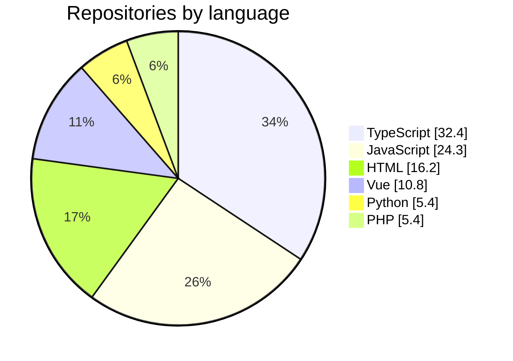

<h1 align="center">Hi there, I'm Ronny Hsieh 👋</h1>

  Front-end developer in Taipei 🇹🇼 — TypeScript, Vue &amp; React, and 3D in the browser.

  
  
  

  <b>387,484</b> npm installs in the last year · <b>7</b> pull requests merged into projects with <b>145,254</b> stars between them · <b>479</b> commits maintaining a community docs site · <b>46</b> stars on my own repositories · on GitHub since <b>2019</b>

## 🧑‍💻 About me

- 🎨 Front-end developer who cares about design systems, accessibility, and code that reads well.
- 🛰️ Day to day I build web apps for a computer-vision / digital-twin platform — React, Next.js, Vue, Vite, and a fair amount of 3D rendering in the browser.
- 📦 I publish small, focused npm packages and use them in my own work.
- 💬 Issues and pull requests on any of my repositories are always welcome.

## 📥 Packages people install

| Package                                                                        | What it is                                                                                 | Installs / month |
| ------------------------------------------------------------------------------ | ------------------------------------------------------------------------------------------ | ---------------- |
| [`react-json-formatter`](https://www.npmjs.com/package/react-json-formatter)   | Formatting json data to JSX of React                                                       | 25,093           |
| [`lorem-ipsum-tc`](https://www.npmjs.com/package/lorem-ipsum-tc)               | Tool for creating Traditional Chinese lorem ipsum                                          | 78               |
| [`condition-switch`](https://www.npmjs.com/package/condition-switch)           | A powerful and flexible TypeScript utility for writing clean, declarative, and expressive… | 62               |
| [`react-form-maker`](https://www.npmjs.com/package/react-form-maker)           | make a react form faster by object                                                         | 60               |
| [`@channel-state/vue`](https://www.npmjs.com/package/@channel-state/vue)       | Vue composables for channel-state, providing seamless integration with Vue applications…   | 54               |
| [`@channel-state/core`](https://www.npmjs.com/package/@channel-state/core)     | Core-library for channel-state, providing framework-agnostic, zero-dependency state…       | 49               |
| [`@channel-state/react`](https://www.npmjs.com/package/@channel-state/react)   | React hooks for channel-state, providing seamless integration with React applications for… | 45               |
| [`ai-agent-press`](https://www.npmjs.com/package/ai-agent-press)               | Transform AI agent instruction and skill files into searchable documentation portals       | 40               |
| [`@channel-state/svelte`](https://www.npmjs.com/package/@channel-state/svelte) | Svelte stores for channel-state, providing seamless integration with Svelte applications…  | 39               |
| [`twinlink`](https://www.npmjs.com/package/twinlink)                           | A lightweight toolkit for creating direct 1-on-1 browser-to-browser connections using…     | 17               |

## 📦 Featured projects

| Project                                                                                                                                                                           | What it does                                                                           | Installs  |
| --------------------------------------------------------------------------------------------------------------------------------------------------------------------------------- | -------------------------------------------------------------------------------------- | --------- |
| [**channel-state**](https://github.com/ronny1020/channel-state) ⭐&nbsp;14 · TypeScript · [v0.1.0](https://www.npmjs.com/package/@channel-state/core)               | A state-management provides robust, seamless state synchronization across all browser… | 49/mo     |
| [**react-json-formatter**](https://github.com/ronny1020/react-json-formatter) ⭐&nbsp;9 · TypeScript · [v0.4.0](https://www.npmjs.com/package/react-json-formatter) | Formatting json data to JSX of React                                                   | 25,093/mo |
| [**condition-switch**](https://github.com/ronny1020/condition-switch) ⭐&nbsp;5 · TypeScript · [v0.1.2](https://www.npmjs.com/package/condition-switch)             | A condition switch library for js/ts                                                   | 62/mo     |
| [**react-form-maker**](https://github.com/ronny1020/react-form-maker) ⭐&nbsp;2 · JavaScript · [v0.4.0](https://www.npmjs.com/package/react-form-maker)             | NPM React tool to make a React form by object                                          | 60/mo     |

## 🤝 Upstream contributions

7 pull requests merged into repositories I do not own:

- **[TanStack/query](https://github.com/TanStack/query)** ⭐&nbsp;50,223  [docs(query-react): Update links in useQuery documentation](https://github.com/TanStack/query/pull/11006) merged Aug&nbsp;17,&nbsp;2026
- **[logicspark/awesome-vitepress-v1](https://github.com/logicspark/awesome-vitepress-v1)** ⭐&nbsp;197  [feat(docs): add `travel-guide-tw.github.io/` blog](https://github.com/logicspark/awesome-vitepress-v1/pull/15) merged Apr&nbsp;6,&nbsp;2025
- **[cypress-io/cypress-documentation](https://github.com/cypress-io/cypress-documentation)** ⭐&nbsp;1,048  [docs(selectFile): readFile & fixture should use `null` instead of `{ encoding: null }`](https://github.com/cypress-io/cypress-documentation/pull/5563) merged Nov&nbsp;17,&nbsp;2023
- **[pixijs/pixijs](https://github.com/pixijs/pixijs)** ⭐&nbsp;48,090  [fix(application): prevent reading property of null if the application is destroyed](https://github.com/pixijs/pixijs/pull/9514) merged Jul&nbsp;6,&nbsp;2023
- **[react-hook-form/react-hook-form](https://github.com/react-hook-form/react-hook-form)** ⭐&nbsp;44,843  [fix(path): keys of `Date | FileList | File` shouldn't be add to the `PathImpl`](https://github.com/react-hook-form/react-hook-form/pull/8804) merged Aug&nbsp;8,&nbsp;2022
- **[visgl/loaders.gl](https://github.com/visgl/loaders.gl)** ⭐&nbsp;853  [docs(pcd): fix pcd-loader example `PCDloader` spell](https://github.com/visgl/loaders.gl/pull/2226) merged Aug&nbsp;1,&nbsp;2022

## 🐛 Bugs I reported that got fixed

Issues I opened in other people's projects that the maintainers labelled a bug and then fixed.

- **[francoismassart/eslint-plugin-tailwindcss](https://github.com/francoismassart/eslint-plugin-tailwindcss)** — [The `font-mono` is considered not a tailwind class with the `fontFamily` setting without mono setting in tailwind.config.js.](https://github.com/francoismassart/eslint-plugin-tailwindcss/issues/249)
- **[vuepress-theme-hope/vuepress-theme-hope](https://github.com/vuepress-theme-hope/vuepress-theme-hope)** — [`vuepress-plugin-comment2` get '@internal/pagesData' imported error during build](https://github.com/vuepress-theme-hope/vuepress-theme-hope/issues/2899)
- **[francoismassart/eslint-plugin-tailwindcss](https://github.com/francoismassart/eslint-plugin-tailwindcss)** — [It takes a lot of time to execute, especially `tailwindcss/classnames-order `](https://github.com/francoismassart/eslint-plugin-tailwindcss/issues/136)
- **[vuejs/eslint-plugin-vue](https://github.com/vuejs/eslint-plugin-vue)** — [rule "vue/no-unused-properties" on <script setup> api component use prop from api defineProps in api computed ](https://github.com/vuejs/eslint-plugin-vue/issues/1643)

## 🗺️ The project I maintain

[**travel-guide-tw/travel-guide-tw.github.io**](https://github.com/travel-guide-tw/travel-guide-tw.github.io) — a community-written Chinese travel guide built with VitePress.

I have written 479 of the 530 human commits in it, across 122 merged pull requests, most recently on May&nbsp;1,&nbsp;2026, alongside 1 other contributor.

## 🚀 Recently pushed

| Repository                                                                                                                     | What it does                                                                               |
| ------------------------------------------------------------------------------------------------------------------------------ | ------------------------------------------------------------------------------------------ |
| [**channel-state**](https://github.com/ronny1020/channel-state) TypeScript · pushed Aug&nbsp;26,&nbsp;2026       | A state-management provides robust, seamless state synchronization across all browser…     |
| [**ai-agent-press**](https://github.com/ronny1020/ai-agent-press) TypeScript · pushed Aug&nbsp;15,&nbsp;2026     | Beautiful, automated AI Agent documentation portal generator. Organize rules, skills, and… |
| [**twinlink**](https://github.com/ronny1020/twinlink) TypeScript · pushed Jul&nbsp;11,&nbsp;2026                 | A lightweight toolkit for creating direct 1-on-1 browser-to-browser connections using…     |
| [**condition-switch**](https://github.com/ronny1020/condition-switch) TypeScript · pushed Jun&nbsp;30,&nbsp;2026 | A condition switch library for js/ts                                                       |

## 🔭 Themes I keep starring

  
  
  
  
  
  
  
  
  
  

<b>🛠️ Tech stack</b> — the tools my own repositories actually depend on

  
  
  
  
  
  
  
  

<b>📊 GitHub in numbers</b> — profile cards and contribution activity

  <picture>
    <source media="(prefers-color-scheme: dark)" srcset="https://raw.githubusercontent.com/ronny1020/ronny1020/master/profile-summary-card-output/github_dark/0-profile-details.svg">
    
  </picture>

  <picture>
    <source media="(prefers-color-scheme: dark)" srcset="https://raw.githubusercontent.com/ronny1020/ronny1020/master/profile-summary-card-output/github_dark/2-most-commit-language.svg">
    
  </picture>
  <picture>
    <source media="(prefers-color-scheme: dark)" srcset="https://raw.githubusercontent.com/ronny1020/ronny1020/master/profile-summary-card-output/github_dark/4-productive-time.svg">
    
  </picture>

  <picture>
    <source media="(prefers-color-scheme: dark)" srcset="https://github-readme-activity-graph.vercel.app/graph?username=ronny1020&theme=github-compact&hide_border=true&area=true">
    
  </picture>

---

  Taipei · README rebuilt from the GitHub API — last run Aug 29, 2026, 8:25 AM GMT+8

